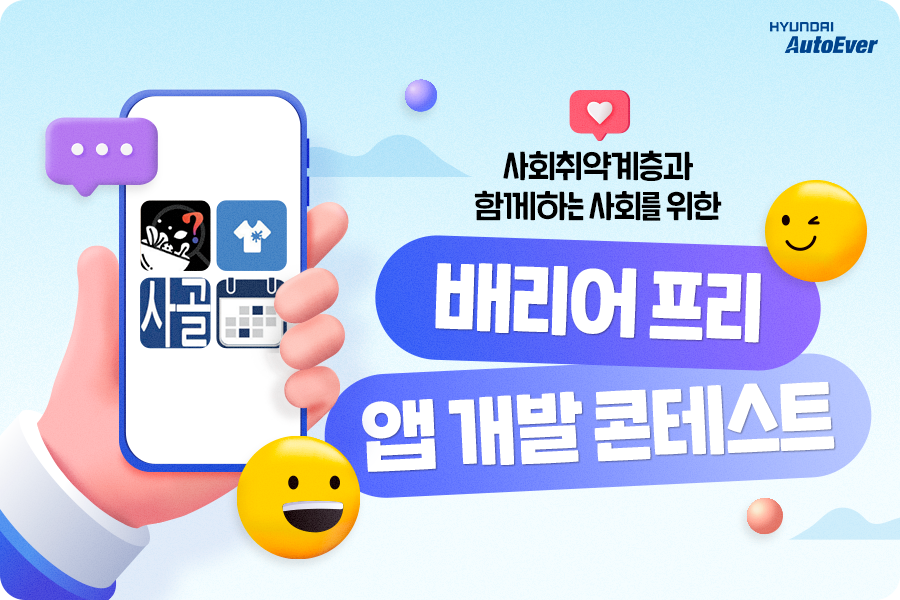
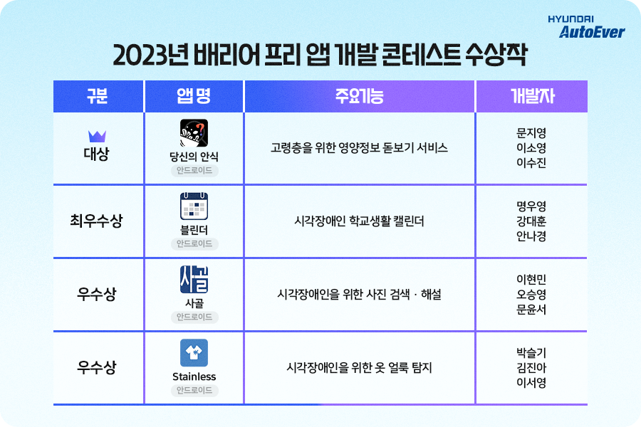
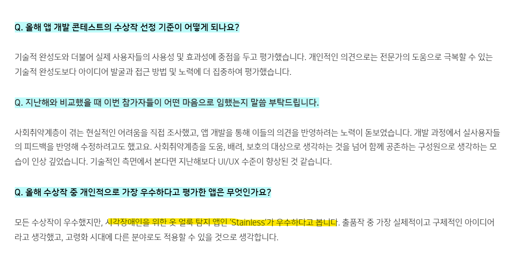
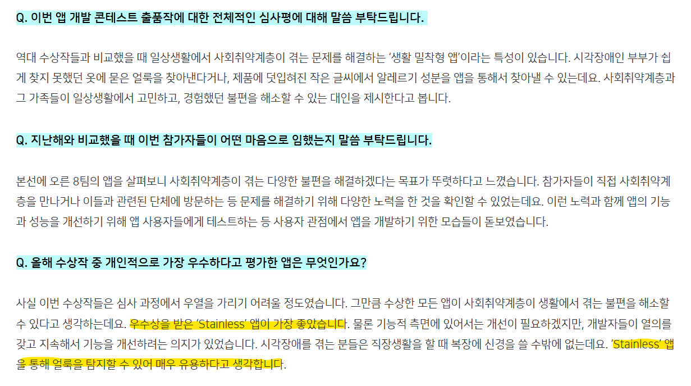
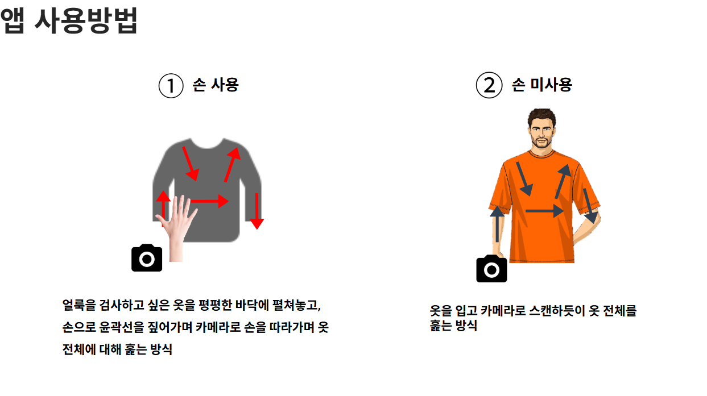
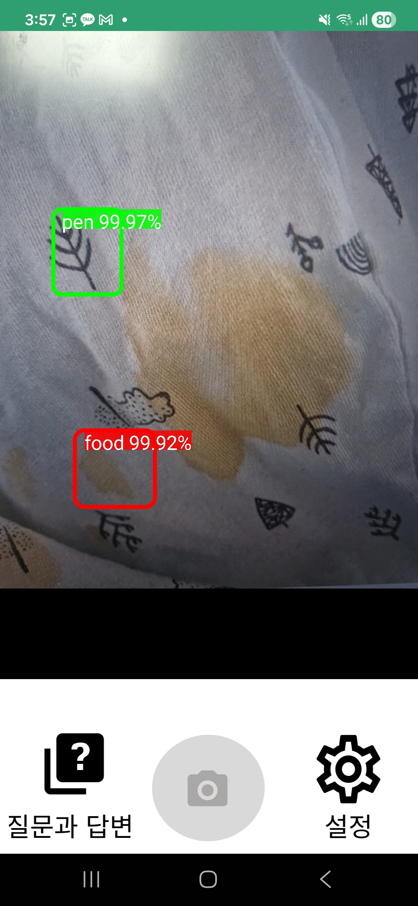
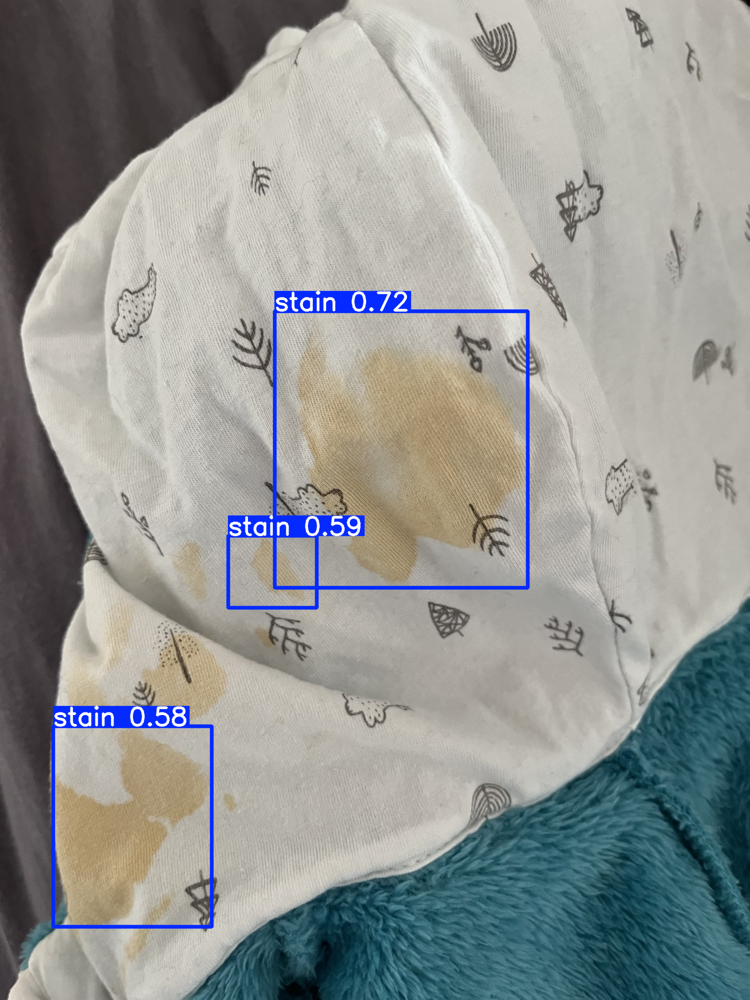
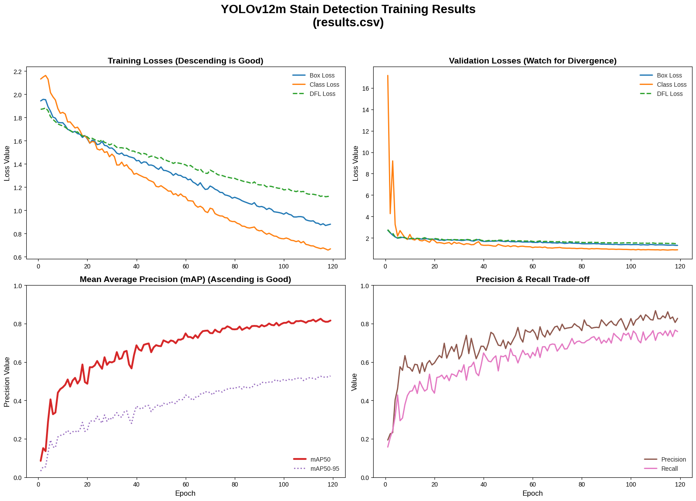
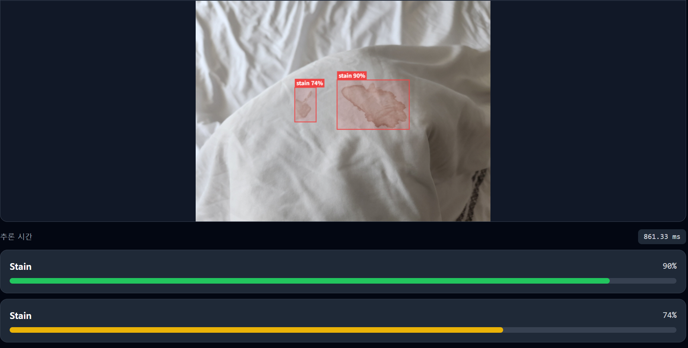

<div align="center">

# 👕 Stainless

### 시각장애인을 위한 실시간 옷 얼룩 탐지 Android 앱

**"보이지 않아도, 깨끗한 옷을 입을 권리"**

YOLOv5 + TensorFlow Lite 온디바이스 AI로 카메라 프리뷰에서 옷의 얼룩을 실시간 탐지하고,
음성(TTS)·진동으로 안내하며, 등록된 연락처에 사진을 공유할 수 있는 배리어프리 앱입니다.


</div>

---

## 🏆 2023 배리어프리 앱 개발 콘테스트 **우수상** 수상

현대오토에버가 주최한 **2023 배리어프리 앱 개발 콘테스트**에서 "시각장애인을 위한 옷 얼룩 탐지" 앱으로 **우수상**을 수상했습니다. (팀원: 박슬기 · 김진아 · 이서영)

> 📰 출처: [현대오토에버 공식 블로그 — 2023 배리어프리 앱 개발 콘테스트 수상작 발표](https://blog.naver.com/hyundai-autoever/223394275807)

| 콘테스트 | 수상작 발표 |
|:---:|:---:|
|  |  |

### 👁️ 심사위원이 바라본 Stainless

> **🚗 현대오토에버 엔터프라이즈IT 김송정 책임**
>
> *"시각장애인을 위한 옷 얼룩 탐지 앱인 'Stainless'가 우수하다고 봅니다. 출품작 중 가장 실체적이고 구체적인 아이디어라고 생각했고, 고령화 시대에 다른 분야로도 적용할 수 있을 것으로 생각합니다."*



> **🧑‍🦯 한국농아인협회 은종규 정책실장**
>
> *"우수상을 받은 'Stainless' 앱이 가장 좋았습니다. 시각장애를 겪는 분들은 직장생활을 할 때 복장에 신경을 쓸 수밖에 없는데요. 'Stainless' 앱을 통해 얼룩을 탐지할 수 있어 매우 유용하다고 생각합니다."*



---

## 📹 시연 영상

| Stainless 시연 영상 | 배리어프리 앱 개발 콘테스트 |
|:---:|:---:|
| [](https://youtube.com/shorts/isyrkpcRVUI?feature=share) | [](http://youtube.com/watch?v=r2XfCuNE8g4) |
| [▶️ YouTube Shorts 바로가기](https://youtube.com/shorts/isyrkpcRVUI?feature=share) | [▶️ YouTube 바로가기](http://youtube.com/watch?v=r2XfCuNE8g4) |

---

## 💡 제작 배경

**기존 서비스의 한계에서 출발했습니다.**

- 설리번 플러스 등 기존 시각장애인용 시력보조 앱은 **얼룩을 탐지하지 못함**
- 전용 얼룩 탐지 기기는 **무겁고 비용이 높아 접근성이 낮음**

**사용자에게 직접 물었습니다.**

- 시각장애인 인터뷰를 통해 옷 얼룩 확인에 대한 **불편함과 니즈를 직접 확인**
- 앱 출시 시 **실제 사용 의향**까지 검증한 후 개발 착수

---

## 🙋 참여 역할 (김진아)

- **사용자 리서치**: 시각장애인 인터뷰 진행 — 옷 얼룩 확인의 불편함·니즈 파악, 실사용 의향 검증
- **AI 모델링**: 얼룩 데이터셋 직접 제작 → 모델 학습 → TFLite 변환
- **앱 개발**: Camera2 API 기반 사진 캡처 로직 작성, 모델을 카메라 캡처 파이프라인과 연결해 **실시간 탐지** 구현
- **발표**: 배리어프리 공모전 중간·최종 심사 발표, 'IT 정보학회' 소논문 작성 및 포스터 발표

---

## 주요 기능

- **실시간 얼룩 탐지**: Camera2 API + YOLOv5로 카메라 프리뷰에서 얼룩 실시간 감지
- **바운딩박스 시각화**: 탐지된 얼룩의 위치와 신뢰도 점수 오버레이 표시
- **TTS 음성 안내**: 탐지 결과를 한국어 음성으로 알림
- **진동 안내**: 탐지 시 진동 피드백 (설정에서 토글)
- **사진 공유**: 탐지된 화면을 등록된 연락처로 MMS 전송
- **다중 추론 가속**: CPU / GPU / NNAPI 선택 가능

### 앱 사용 방법

시각장애인 사용자가 카메라 화각을 잡기 어렵다는 점을 고려해, 두 가지 스캔 방식을 설계했습니다.



---

## 기술 스택

| 분류 | 내용 |
|------|------|
| 언어 | Java |
| 플랫폼 | Android (minSdk 21, targetSdk 33) |
| ML 프레임워크 | TensorFlow Lite 2.4.0 |
| 모델 | YOLOv5 (FP16, 640×640 입력) |
| 카메라 | Camera2 API |
| 빌드 | Gradle 8.1.3 |

---

## 탐지 흐름

```
카메라 프레임 캡처 (Camera2)
        ↓
YUV → RGB 변환 (ImageUtils)
        ↓
이미지 640×640 리사이즈 (Utils)
        ↓
YOLOv5 모델 추론 (YoloV5Classifier)
        ↓
신뢰도 필터링 (> 0.3)
        ↓
객체 추적 (MultiBoxTracker)
        ↓
오버레이 렌더링 (OverlayView)
        ↓
TTS 음성 안내 / 진동 피드백
```

---

## 🔎 성능 분석과 개선 고민

수상 이후에도 멈추지 않고, 실사용 관점에서 모델의 한계를 정량적으로 분석하고 개선을 이어갔습니다.

### 성능 비교 테스트 — 온디바이스 YOLOv5의 한계

| Stainless (온디바이스 · YOLOv5) | 개선 모델 (YOLOv12) |
|:---:|:---:|
|  |  |
| 옷의 무늬를 얼룩으로 **오탐지(False Positive)**<br>커다란 얼룩임에도 **미탐지(False Negative)**<br>**mAP50 = 0.55** — 평균 정밀도 저조 | 옷의 무늬 오탐지 문제 개선<br>대부분의 얼룩 탐지 성공<br>**mAP50 = 0.8** — 탐지 정확도 개선 |



### 문제 1 — 특정 얼룩이 탐지되지 않음 (미탐지)

- **원인**: 기존 데이터셋의 편향성
  - 연한 얼룩 이미지 부족 (1,000장 중 100장)
  - 색 편향 — 보라·파랑처럼 음식/음료 얼룩과 거리가 먼 색상 데이터 부족
- **해결 노력**
  - 모델 학습: `hsv_s=0.5` — 채도(saturation)를 절반 수준으로 낮춰 연한 얼룩에 강건하도록 조정
  - 데이터 증강: `Grayscale 10%` — 색보다 **패턴**에 집중하도록 유도, `Hue ±25°` — 색상 다양성 확보
- **한계와 개선 방향**
  - 학습 전략·증강만으로는 데이터셋 자체의 결함을 극복하기 어려움
  - **개선 방향 (1)**: 후속 플랫폼(Micro-Lens)에서 사용자 업로드 얼룩 데이터를 서버에 저장 → 모델 재학습에 활용하는 **데이터 선순환 구조** 구상 (참고: 테슬라 월드모델 선순환 구조)
  - **개선 방향 (2)**: 모델이 어려워하는 엣지 케이스(보라색·하얀색·연한 채도 얼룩)만 추가 수집·재학습하는 **오답노트 전략**

### 문제 2 — 얼룩이 아닌 것을 얼룩으로 오탐지

- **원인 (1)**: YOLOv5(CNN) 구조 자체의 한계 — 국소 부위만 학습해 전체 맥락 파악에 약함
  - **해결**: YOLOv12의 attention(transformer) 특성을 활용해 맥락 파악 강화 → 단추·패턴을 얼룩으로 착각하는 현상 감소

  

- **원인 (2)**: 학습 데이터셋에 배경 이미지 부재 — 주변 사물과 옷을 구분하지 못함
  - **해결**: 전체 데이터셋의 약 10% 분량으로 얼룩 라벨링 없는 깨끗한 옷 이미지(배경 이미지) 추가 → 얼룩뿐 아니라 '옷과 사물'이라는 전체 맥락 학습
  - **결과**: 배경 이미지 미포함 **mAP 0.6 → 포함 시 mAP 0.8**

---

## 🔭 후속 프로젝트 — Micro-Lens

Stainless를 디벨롭한 1인 프로젝트로, YOLOv12 + AWS/Kubernetes 기반 웹 서비스로 발전시켰습니다.

> **"일상 속 미세한 부분까지, 대신 확인해주는 시력보조 파트너"**

- 🌐 도메인: [https://microlens.cloud](https://microlens.cloud/)
- 📹 시연 영상: [https://youtu.be/7jnekg9lZeo](https://youtu.be/7jnekg9lZeo)
- 💻 GitHub: [microlens-infra](https://github.com/MICRO-LENS/microlens-infra) · [microlens-ai-api](https://github.com/MICRO-LENS/microlens-ai-api) · [microlens-client](https://github.com/MICRO-LENS/microlens-client)

| 얼룩 탐지 (신뢰도 90%) | 미세 얼룩 다중 탐지 |
|:---:|:---:|
|  |  |

---

## 빌드 및 실행

### 요구 사항

- Android Studio Hedgehog 이상
- JDK 1.8
- Android 기기 또는 에뮬레이터 (API 21+, OpenGL ES 3.1 필수)

### 빌드

```bash
git clone https://github.com/catapillar0505/Stainless.git
cd Stainless
./gradlew assembleDebug
```

또는 Android Studio에서 프로젝트를 열고 **Run > Run 'app'** 실행.

### 권한

앱 실행 시 다음 권한이 필요합니다.

- `CAMERA` — 카메라 프리뷰 및 탐지
- `VIBRATE` — 진동 안내
- `READ_CONTACTS` — 연락처 등록
- `READ_EXTERNAL_STORAGE` — 이미지 저장/공유
- `INTERNET` — (선택) 네트워크 연결

---

## 모델 정보

| 항목 | 내용 |
|------|------|
| 모델 파일 | `best-fp16.tflite` |
| 입력 크기 | 640 × 640 |
| 정밀도 | FP16 |
| 파일 크기 | 39.9 MB |
| 신뢰도 임계값 | 0.3 (30%) |

### 지원 추론 가속

- **CPU**: 기본, 멀티스레드 지원
- **GPU**: GpuDelegate (지속 속도 모드)
- **NNAPI**: Android P 이상 기기에서 사용 가능

`DetectorActivity`의 하단 시트에서 런타임 중 가속 방식 및 스레드 수를 변경할 수 있습니다.

### 커스텀 모델 교체

`DetectorFactory.java`에서 모델 파일명과 입력 크기를 수정하고, `assets/` 에 새 `.tflite` 파일을 추가하면 됩니다.

```java
// DetectorFactory.java
detector = YoloV5Classifier.create(
    assetManager,
    "your-model.tflite",   // 모델 파일명
    "your-classes.txt",    // 클래스 파일명
    isQuantized,
    inputSize              // 640 등
);
```

---

## 프로젝트 구조

```
app/src/main/
├── java/stainless/tensorflow/lite/examples/detection/
│   ├── DetectorActivity.java       # 메인 카메라 탐지 화면
│   ├── CameraActivity.java         # Camera2 기본 추상 클래스
│   ├── SettingActivity.java        # 설정 (진동, 연락처 관리)
│   ├── QnaActivity.java            # 문의 화면
│   ├── MainActivity.java           # 이미지 탐지 테스트 화면
│   ├── ContactModel.java           # 연락처 데이터 모델
│   ├── ContactAdapter.java         # 연락처 RecyclerView 어댑터
│   ├── customview/
│   │   ├── OverlayView.java        # 탐지 결과 캔버스 오버레이
│   │   ├── AutoFitTextureView.java # 카메라 프리뷰 TextureView
│   │   ├── RecognitionScoreView.java
│   │   └── ResultsView.java
│   ├── env/
│   │   ├── Utils.java              # 이미지 변환, 모델 로드 유틸
│   │   ├── ImageUtils.java         # YUV→RGB 변환, 비트맵 저장
│   │   ├── Logger.java             # 로깅 유틸
│   │   ├── BorderedText.java       # 경계선 텍스트 렌더링
│   │   └── Size.java
│   └── tracking/
│       └── MultiBoxTracker.java    # 객체 추적 및 바운딩박스 렌더링
│   ├── Classifier.java             # 분류기 인터페이스
│   ├── YoloV5Classifier.java       # YOLOv5 추론 엔진
│   ├── YoloV5ClassifierDetect.java
│   └── DetectorFactory.java        # 모델 생성 팩토리
├── res/
│   ├── layout/                     # XML 레이아웃 (10개)
│   ├── drawable/                   # 아이콘 리소스
│   └── values/                     # 색상, 문자열 정의
└── assets/
    ├── best-fp16.tflite            # 메인 YOLOv5 모델 (39.9MB)
    ├── customclasses2.txt          # 탐지 클래스 목록
    ├── test.jpg                    # 테스트 이미지
    └── test2.jpg
```

---

<details>
<summary><b>개인정보처리방침</b></summary>

### 1. 개인정보의 처리 목적

본 개발자가 작성한 앱은 다음의 목적을 위하여 개인정보를 처리하며, 다음의 목적 이외의 용도로는 이용하지 않습니다.

- 앱 사용자의 사용정보를 수집 및 보유하지 않습니다.

### 2. 개인정보처리 위탁 여부

- 본 개발자의 앱은 타 업체에 개인정보처리를 위탁하지 않습니다.

### 3. 정보주체의 권리, 의무 및 그 행사방법

- 이용자는 개인정보주체로서 언제든지 개인정보 보호 관련 권리를 행사할 수 있습니다.
- 다만, 본 앱은 앱 사용자의 사용정보를 수집 및 보유하지 않습니다.

### 4. 처리하는 개인정보의 항목

- 앱 사용자의 사용정보를 수집 및 보유하지 않습니다.

### 5. 개인정보의 파기

- 앱 사용자의 사용정보를 수집 및 보유하지 않으므로, 파기해야 할 개인정보가 없습니다.

### 6. 개인정보의 안전성 확보 조치

- 앱 사용자의 사용정보를 수집 및 보유하지 않습니다.

</details>
